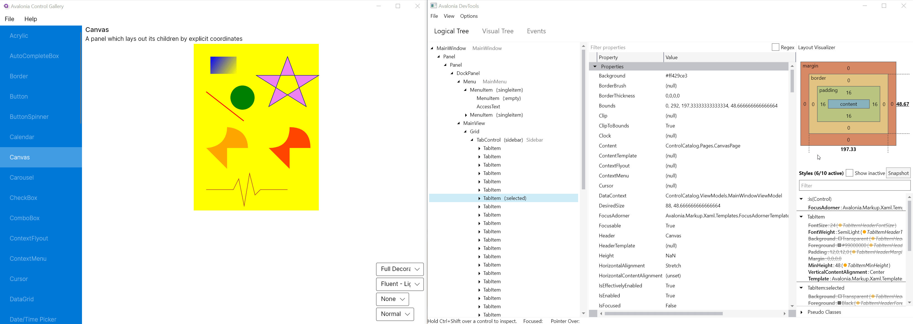

# 开发者工具

Avalonia 有一个内置的 DevTools 窗体，通过在 `Window` 的构造函数中调用附加的 `AttachDevTools()` 方法来启用该窗口。当程序在 `DEBUG` 模式下编译时，默认模板会开启此功能：

```csharp
public partial class MainWindow : Window
{
    public MainWindow()
    {
        InitializeComponent();
    }
}

// in auto-generated by Avalonia.NameGenerator MainWindow.g.cs:
partial class MainWindow
{
    // ...
    public void InitializeComponent(bool loadXaml = true, bool attachDevTools = true)
    {
        // ...
#if DEBUG
        if (attachDevTools)
        {
            this.AttachDevTools();
        }
#endif
        // ...
    }
}
```

要打开 DevTools，请按 F12，或向 `this.AttachDevTools()` 方法传递不同的 `Gesture` 以设置不同的快捷键。


从 release 0.10 版本开始，要使用 DevTools，必须添加 `Avalonia.Diagnostics` nuget 包。

```bash
dotnet add package Avalonia.Diagnostics --version 0.10.0
```



.png>)

在 .NET core 2.1 下运行时存在一个已知问题，即按 F12 将导致程序退出。在这种情况下，要么切换到 .NET core 2.0 或 3.0+，要么更改快捷键，例如 `Ctrl+F12`。

## Logical Tree 和 Visual Tree

`Logical Tree` 和 `Visual Tree` 选项卡展示了控件在窗体中的逻辑树和可视化树。选中一个控件后，右侧的窗格中会显示该控件的属性，可以在这个窗格中编辑该控件的属性。

### 属性

允许快速查看和编辑控件的属性。还可以搜索属性（通过名称或使用正则表达式）。

| 列名       | 描述     |
|----------|--------|
| Property | 属性的名称  |
| Value    | 属性的当前值 |
| Type     | 当前值的类型 |
| Priority | 值的优先级  |

.png>)

### 布局

允许检查和编辑常用布局属性\(`Margin`, `Border` , `Padding`\)
还显示了控件大小和大小约束。


如果 `Width` 或 `Height` 带下划线，则表示存在活动约束。将光标悬停在该值上可查看包含相关信息的工具提示。


 (1) (1).png>)

### 样式

[properties](developer-tools.md#properties) 面板显示了当前属性的活动值(active values)，样式面板显示了所有值和值的来源。

此外，可以看到可能与此控件匹配的所有样式（通过切换 `Show inactive` 选项）。

当前样式可以通过按下 `Snapshot` 按钮或在悬停在目标窗口上时按下 `Alt+S` 记录快照。快照意味着样式面板不会随着控件的状态变化而更新。这在排除有 `:pointerover` 或 `:pressed` 的选择器的问题时特别有用。


如果赋值器的值绑定了一个资源，它将指示成一个圆圈后接资源键的形式。
If setter value is bound to a resource it will be indicated by a circle followed by the resource key.


.png>)


如果给定的值含有删除线，则表示该值被具有更高优先级的样式中的值覆盖了。


.png>)

赋值器有一个上下文菜单，能够快速将名称和值复制到剪贴板。

.png>)

## 事件

事件选项卡用来跟踪 [事件](../input/) 的传播。在左窗格中选择要跟踪的事件，该类型的所有事件都将显示在中上部分的窗格中。可以选择其中一个事件查看事件路由。


事件名称或控件类型下面的点下划线示意可以快速导航。

* 双击事件类型将选择并滚动到给定的事件类型
* 双击控件类型（和/或名称）将导航到可视化树选项卡并选中该控件。

.png>)

## 控制台

可以使用 View → Console 菜单显示控制台。控制台实现了一个 C# REPL，它可以用来运行任意的 C# 代码。在控制台会话中，可以使用以下预定义变量：

* `help`: 输出帮助信息
* `e`: 在逻辑树或可视化树中当前选中的控件
* `root`: 可视化树的根

## 快捷键

| 按键组合       | 功能       |
|------------|----------|
| Alt+S      | 启用快照样式   |
| Alt+D      | 禁用快照样式   |
| CTRL+Shift | 通过指针定位控件 |
| CTRL+Alt+F | 冻结切换的弹出框 |

## 示例

### 更改属性值


### 更改布局属性


